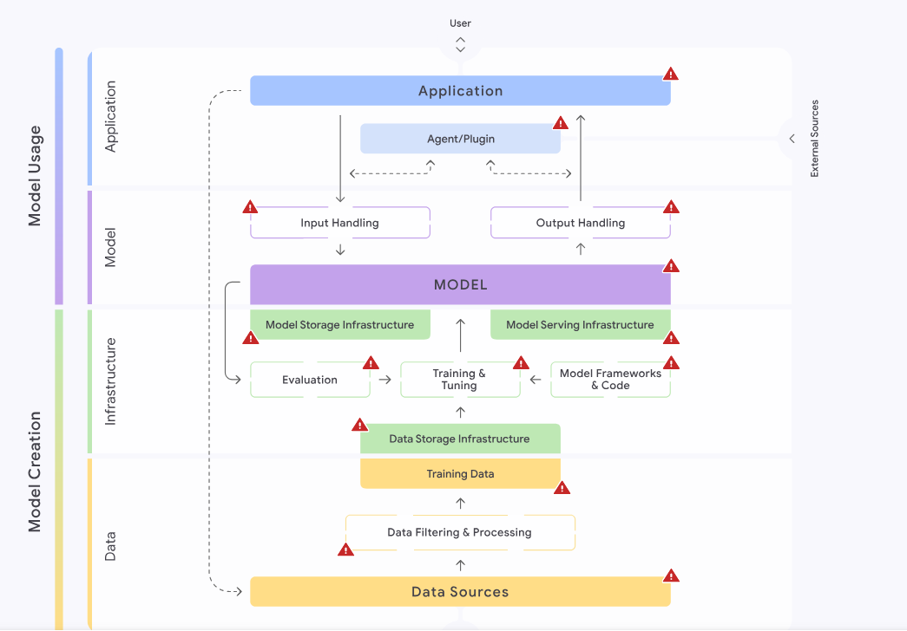

# Introduction

## ML Systems

Just like for [Web Applications](https://owasp.org/www-project-top-ten/), [Web APIs](https://owasp.org/www-project-api-security/), and [Mobile Applications](https://owasp.org/www-project-mobile-top-10/), OWASP has published a Top 10 list of security risks regarding the deployment and management of ML-based Systems, the [Top 10 for Machine Learning Security](https://owasp.org/www-project-machine-learning-security-top-10/). We will briefly discuss the ten risks to obtain an overview of security issues resulting from ML-based systems.

| ID   | Description                                                                                                                                                                           |
| ---- | ------------------------------------------------------------------------------------------------------------------------------------------------------------------------------------- |
| ML01 | `Input Manipulation Attack`: Attackers modify input data to cause incorrect or malicious model outputs.                                                                               |
| ML02 | `Data Poisoning Attack`: Attackers inject malicious or misleading data into training data, compromising model performance or creating backdoors.                                      |
| ML03 | `Model Inversion Attack`: Attackers train a separate model to reconstruct inputs from model outputs, potentially revealing sensitive information.                                     |
| ML04 | `Membership Inference Attack`: Attackers analyze model behavior to determine whether data was included in the model's training data set, potentially revealing sensitive information. |
| ML05 | `Model Theft`: Attackers train a separate model from interactions with the original model, thereby stealing intellectual property.                                                    |
| ML06 | `AI Supply Chain Attacks`: Attackers exploit vulnerabilities in any part of the ML supply chain.                                                                                      |
| ML07 | `Transfer Learning Attack`: Attackers manipulate the baseline model that is subsequently fine-tuned by a third-party. This can lead to biased or backdoored models.                   |
| ML08 | `Model Skewing`: Attackers skew the model's behavior for malicious purposes, for instance, by manipulating the training data set.                                                     |
| ML09 | `Output Integrity Attack`: Attackers manipulate a model's output before processing, making it look like the model produced a different output.                                        |
| ML10 | `Model Poisoning`: Attackers manipulate the model's weights, compromising model performance or creating backdoors.                                                                    |

## LLM Systems

### OWASP Top 10

| ID    | Description                                                                                                                                                                   |
| ----- | ----------------------------------------------------------------------------------------------------------------------------------------------------------------------------- |
| LLM01 | `Prompt Injection`: Attackers manipulate the LLM's input directly or indirectly to cause malicious or illegal behavior.                                                       |
| LLM02 | `Insecure Output Handling`: LLM Output is handled insecurely, resulting in injection vulnerabilities such as Cross-Site Scripting (XSS), SQL Injection, or Command Injection. |
| LLM03 | `Training Data Poisoning`: Attackers inject malicious or misleading data into the LLM's training data, compromising performance or creating backdoors.                        |
| LLM04 | `Model Denial of Service`: Attackers feed inputs to the LLM that result in high resource consumption, potentially causing disruptions to the LLM service.                     |
| LLM05 | `Supply Chain Vulnerabilities`: Attackers exploit vulnerabilities in any part of the LLM supply chain.                                                                        |
| LLM06 | `Sensitive Information Disclosure`: Attackers trick the LLM into revealing sensitive information in the response.                                                             |
| LLM07 | `Insecure Plugin Design`: Attackers exploit security vulnerabilities in LLM plugins.                                                                                          |
| LLM08 | `Excessive Agency`: Attackers exploit insufficiently restricted LLM access.                                                                                                   |
| LLM09 | `Overreliance`: An organization is overly reliant on an LLM's output for critical business decisions, potentially leading to security issues from unexpected LLM behavior.    |
| LLM10 | 

<code>Model Theft</code>: Attackers gain unauthorized access to the LLM itself, stealing intellectual property and potentially causing financial harm.
          |

### Google's Secure AI Framework (SAIF)

An additional framework covering security risks in AI applications is Google's [Secure AI Framework (SAIF)](https://saif.google/). It provides actionable principles for secure development of the entire AI pipeline - from data collection to model deployment. While SAIF provides a list of security risks similar to OWASP, it goes even further and provides a holistic approach to developing secure AI applications. This includes the integration of security and privacy in the entire AI pipeline. OWASP provides a targeted, technical checklist of vulnerabilities, whereas SAIF offers a broader perspective on secure AI development as a whole.

In SAIF, there are four different areas of secure AI development. Each comprises multiple [components](https://saif.google/secure-ai-framework/components):

* `Data`: This area consists of all components relating to data such as `data sources`, `data filtering and processing`, and `training data`.
* `Infrastructure`: This area relates to the hardware on which the application is hosted, as well as data storage and development platforms. Infrastructure components are the `Model Frameworks and Code` required to run the AI application, the processes of `Training, Tuning, and Evaluation`, `Data and Model Storage`, and the process of deploying a model (`Model Serving`).
* `Model`: This is the central area of any AI application. It comprises the `Model`, `Input Handling`, and `Output Handling` components.
* `Application`: This area relates to the interaction with the AI application, i.e., it consists of the `Applications` interacting with the AI deployment and potential `Agents` or `Plugins` used by the AI deployment.

<figure><figcaption></figcaption></figure>
