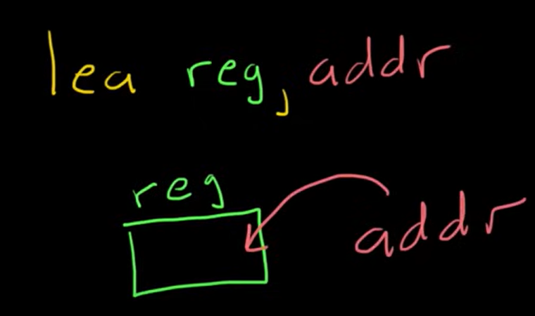

# Assembly

## x86

Programs have 4 components:

* Heap
* Stack
* Registers
* Instructions

### Heap

Manual memory allocation

Function like malloc,alloc, global and static variables are here

### Registers

Small storage area for addrs or values. Six generals:

* eax
* ebx
* ecx
* edx
* esi
* edi

and thre reserved for special purpose:

* ebp
* esp
* eip

### Stack

Data structure composed of elements managed by the operation push and pop.

Every stack object has a stack address. When a object from the stack is called it creates a stack fram with all of his variables. The ebp contains the address of the first stack frame base, while the esp contain the top element of the stack frame.

## x64

### Registers

rbp: Base Pointer, points to the bottom of the current stack frame
\
rsp: Stack Pointer, points to the top of the current stack frame
\
rip: Instruction Pointer, points to the instruction to be executed

```
General Purpose Registers
These can be used for a variety of different things
rax:
rbx:
rcx:
rdx:
rsi:
rdi:
r8:
r9:
r10:
r11:
r12:
r13:
r14:
r15:
```

n `x64` linux arguments to a function are passed via registers. The first few args are passed by these registers:

```
rdi:    First Argument
rsi:    Second Argument
rdx:    Third Argument
rcx:    Fourth Argument
r8:     Fifth Argument
r9:     Sixth Argument
```

In `x64`, this value is passed in the `rax` register.&#x20;

### Words

You might hear the term word throughout this. A word is just two bytes of data. A dword is four bytes of data. A qword is eight bytes of data.

### Stack

The exact bounds of the stack is recorded by two registers, `rbp` and `rsp`. The base pointer `rbp` points to the bottom of the stack. The stack pointer `rsp` points to the top of the stack.

For instance, in this code the variable `x` is stored in the stack:

```
#include <stdio.h>

void main(void)
{
    int x = 5;
    puts("hi");
}
```

Specifically we can see it is stored on the stack at `rbp-0x4`.

```
0000000000001135 <main>:
    1135:       55                      push   rbp
    1136:       48 89 e5                mov    rbp,rsp
    1139:       48 83 ec 10             sub    rsp,0x10
    113d:       c7 45 fc 05 00 00 00    mov    DWORD PTR [rbp-0x4],0x5
    1144:       48 8d 3d b9 0e 00 00    lea    rdi,[rip+0xeb9]        # 2004 <_IO_stdin_used+0x4>
    114b:       e8 e0 fe ff ff          call   1030 <puts@plt>
    1150:       90                      nop
    1151:       c9                      leave  
    1152:       c3                      ret    
    1153:       66 2e 0f 1f 84 00 00    nop    WORD PTR cs:[rax+rax*1+0x0]
    115a:       00 00 00
    115d:       0f 1f 00                nop    DWORD PTR [rax]
```

### Flags

There is one register that contains flags. A flag is a particular bit of this register. If it is set or not, will typically mean something. Here is the list of flags.

```
00:     Carry Flag
01:     always 1
02:     Parity Flag
03:     always 0
04:     Adjust Flag
05:     always 0
06:     Zero Flag
07:     Sign Flag
08:     Trap Flag
09:     Interruption Flag     
10:     Direction Flag
11:     Overflow Flag
12:     I/O Privilege Field lower bit
13:     I/O Privilege Field higher bit
14:     Nested Task Flag
15:     Resume Flag
```

## Assembly instruction format

#### Operation

Contain one to two arguments separated by a `,`&#x20;

**MOV**

will just copy the address where the var is contained. To copy the value you need  square brackets `[ ]`&#x20;

**ADD and SUB**

Sum the value of two args and store the result in the first. Sub is the opposite.

**CMP**

Compare is similar to sub but will give the result as 0, <0 or >0

Always followed by **JUMP** instruction

jmp will check the flag and depending on the state will set the address on his argument

**LEA ( load effective address)**

take the address specified by the second arg (addr) and put it in the specified one from the first arg (reg)&#x20;

<figure><figcaption></figcaption></figure>


**CALL**

Push the return address of the function called in to the stack and move the eip to the first instruction of the function

**LEAVE**

Destroy the current stack by placing the esp in the same position as the ebp.

Always follow the **RET** function that will pop the return address from the top of the stack and will set the esp in that address

***

Every instruction has an instruction address, the area and memory where the instruction is stored

