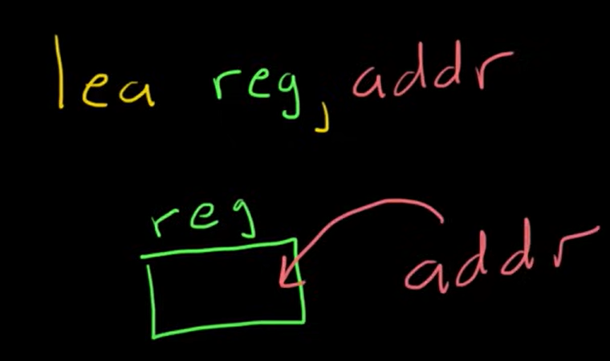

# Race Conditions

### Single-endpoint race conditions 

Sending parallel requests with different values to a single endpoint can sometimes trigger powerful race conditions.

Consider a password reset mechanism that stores the user ID and reset token in the user's session.

In this scenario, sending two parallel password reset requests from the same session, but with two different usernames, could potentially cause the following collision:

<figure><figcaption></figcaption></figure>

Note the final state when all operations are complete:

* `session['reset-user'] = victim`
* `session['reset-token'] = 1234`

### Partial construction race conditions 

Many applications create objects in multiple steps, which may introduce a temporary middle state in which the object is exploitable.

For example, when registering a new user, an application may create the user in the database and set their API key using two separate SQL statements. This leaves a tiny window in which the user exists, but their API key is uninitialized.

This kind of behavior paves the way for exploits whereby you inject an input value that returns something matching the uninitialized database value, such as an empty string, or `null` in JSON, and this is compared as part of a security control.

Frameworks often let you pass in arrays and other non-string data structures using non-standard syntax. For example, in PHP:

* `param[]=foo` is equivalent to `param = ['foo']`
* `param[]=foo&param[]=bar` is equivalent to `param = ['foo', 'bar']`
* `param[]` is equivalent to `param = []`
